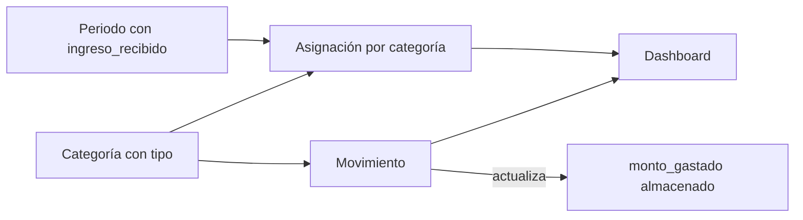
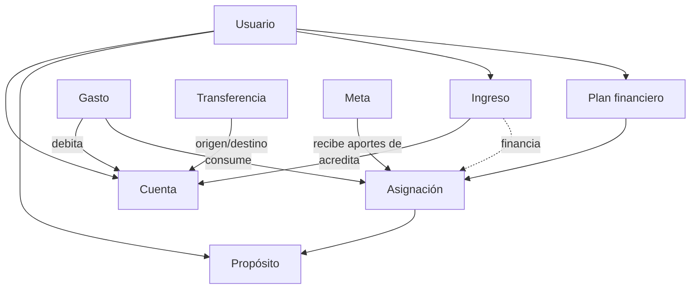
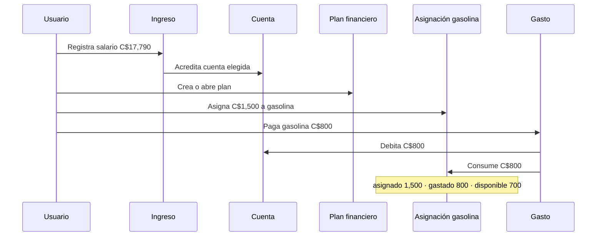

# Análisis de dominio: finanzas personales orientadas a propósito

Fecha: 2026-07-23  
Estado: propuesta de arquitectura; no implica cambios de código ni de datos.

## Resumen ejecutivo

La aplicación tiene una base adecuada para una experiencia de planificación: hoy crea un `Periodo`, registra un ingreso inicial y genera `AsignacionPresupuesto` por categoría antes de los gastos. Sin embargo, el modelo actual confunde cuatro ideas distintas: **clasificar**, **planificar**, **registrar hechos de dinero** y **ahorrar para el futuro**.

La propuesta no es reemplazar el proyecto. Es evolucionar desde un presupuesto centrado en períodos hacia un modelo de **dinero recibido → dinero asignado a propósitos → movimiento real**, manteniendo los flujos y pantallas existentes durante la transición.

La decisión recomendada es **no conservar “Fondo” como entidad nuclear**. “Fondo” puede permanecer como una palabra o vista de producto (por ejemplo, “Fondo vacaciones”), pero en el dominio debe representarse como:

- un **propósito/categoría** si solo clasifica una asignación;
- una **meta** si persigue un importe objetivo a lo largo del tiempo;
- una **cuenta o reserva** si representa dinero físicamente separado.

## Alcance de la revisión

Se revisaron, sin realizar modificaciones:

- Tipos de dominio: `types/index.ts`.
- Puerto de persistencia y su implementación local: `lib/data/types.ts`, `lib/data/local-provider.ts`, `lib/data/seed.ts`.
- Flujos de planificación, transacciones, tablero y configuración.
- El proyecto usa almacenamiento local; actualmente no contiene una base de datos ni migraciones.

El árbol de trabajo ya contiene cambios del usuario. Este análisis los trata como contexto y no los altera.

## Modelo que existe hoy

| Elemento actual | Rol que intenta cumplir | Observación |
| --- | --- | --- |
| `Categoria` | Clasifica ingresos, presupuestos, gastos fijos y variables | Su único `tipo` mezcla naturaleza del movimiento, comportamiento de planificación y objetivo financiero. |
| `Periodo` | Ventana quincenal/mensual, ingreso principal y estado | Es a la vez ciclo de planificación, contenedor de ingresos y mecanismo de cierre. |
| `AsignacionPresupuesto` | Monto destinado y gastado por categoría en un período | Es la pieza más cercana a una asignación de propósito, pero duplica el gasto calculable desde movimientos. |
| `Movimiento` | Gasto y también ingreso extra | No expresa explícitamente dirección/tipo de movimiento; se infiere por la categoría. No conoce una cuenta ni una asignación concreta. |
| `PlantillaPresupuesto` | Distribución sugerida por período | Útil y reutilizable; está acoplada a quincenal/mensual e ingreso sugerido. |
| `Meta` | Objetivo de ahorro | Tiene saldo propio, pero no se integra con ingresos, asignaciones ni movimientos. |
| `ConfiguracionQuincena` | Preferencia de corte y ahorro | Presenta quincena como regla global, aunque es solo una posible cadencia del usuario. |

## Flujo real implementado y puntos de fricción

1. La pantalla de planificación captura un único `ingreso_recibido` y distribuye el monto entre categorías.
2. Al confirmar, el proveedor cierra automáticamente cualquier período activo y crea las asignaciones.
3. Un gasto se registra contra `periodo_id` y `categoria_id`; si hay coincidencia, aumenta `monto_gastado`.
4. Un “ingreso extra” aumenta un acumulado del período y además se guarda como `Movimiento` con la categoría fija `cat-ingreso-extra`.

Este flujo explica el producto actual, pero no preserva con precisión la intención financiera cuando se agreguen varias cuentas, ingresos irregulares, transferencias, reasignaciones o ahorro acumulativo.

## Problemas encontrados

### 1. `Categoria.tipo` tiene responsabilidades incompatibles

`PRESUPUESTO`, `GASTO_FIJO`, `GASTO_VARIABLE` e `INGRESO` no pertenecen al mismo eje:

- **Ingreso o gasto** describe la dirección de un hecho de dinero.
- **Fijo o variable** describe un patrón esperado, no la naturaleza del dinero.
- **Presupuesto** describe una decisión de planificación, no una categoría.
- **Fondo** suele describir un saldo reservado, una meta o una cuenta; tampoco es una categoría.

Ejemplo: “Gasolina” puede ser variable, planificada y pagada desde efectivo. Ninguna de esas propiedades debe competir dentro de un único enum.

### 2. El ingreso no es una entidad de primer nivel

El ingreso principal está embebido en `Periodo`; el extra se representa como un movimiento identificado por una categoría especial. Ambos son ingresos, pero tienen representaciones y reglas diferentes.

Consecuencia verificable: el cálculo actual de `total_gastado` suma todos los movimientos del período sin separar ingresos; por ello un ingreso extra puede incrementar artificialmente el gasto mostrado en KPI.

### 3. La asignación mantiene un saldo derivado como fuente paralela de verdad

`AsignacionPresupuesto.monto_gastado` se actualiza al crear o eliminar gastos. Sin embargo, `editarMovimiento` no ajusta la asignación ni el período si cambia monto, categoría o fecha. Esto permite desincronización entre el historial y el saldo mostrado.

En una futura base de datos, este problema empeoraría con concurrencia. El gasto consumido debe calcularse a partir de movimientos/consumos inmutables, o actualizarse transaccionalmente como una proyección que pueda reconstruirse.

### 4. Falta el vínculo exacto entre gasto y asignación

El gasto solo referencia categoría y período. Eso presupone una asignación única por `(período, categoría)` y hace imposible:

- dividir una categoría en varias asignaciones con propósitos distintos;
- elegir de qué asignación sale un gasto;
- mover remanentes entre asignaciones con trazabilidad;
- conservar una asignación para el próximo ciclo.

La “detección automática” deseada debe ser una **sugerencia determinista**, no una inferencia oculta: si existe una sola asignación abierta elegible para la categoría, se preselecciona; si hay varias, se solicita confirmación.

### 5. El período es demasiado central y restrictivo

Cerrar todo período activo al iniciar otro equivale a imponer un solo ciclo abierto. Eso no se ajusta bien a personas con ingreso semanal, varios contratos, cobros irregulares o planificación por evento. El período debe ser una herramienta opcional de visualización/cadencia, no la identidad del dinero recibido.

Además, solo se permiten `QUINCENAL` y `MENSUAL`, aunque el objetivo explícito requiere semanal e irregular.

### 6. No existe cuenta financiera

`MetodoPago` solo distingue efectivo/tarjeta. No modela origen ni destino del dinero, saldo de caja, cuenta bancaria, tarjeta de crédito, transferencia entre cuentas o conciliación. Para usuarios con efectivo y varias cuentas, este es el principal vacío funcional futuro.

### 7. El concepto de “fondo” está ambiguo

Los datos semilla crean “Fondo Misceláneo”, “Fondo Teléfono” y “Fondo Internet” como categorías `PRESUPUESTO`. A la vez, otras categorías planificables son `GASTO_FIJO` o `GASTO_VARIABLE`. Esa diferencia no cambia el mecanismo de asignación; cambia solo etiquetas y reportes. Es señal de que el tipo está codificando vocabulario de UI, no una regla del dominio.

### 8. Reglas de negocio todavía no están protegidas de forma uniforme

- La experiencia celebra 100% asignado, pero permite confirmar con dinero sin asignar.
- Se permite gastar por encima de lo asignado; puede ser correcto como política configurable, pero no está explicitado.
- Se puede crear un movimiento para categorías sin asignación y no queda visible como excepción de planificación.
- Los importes usan `number`; para dinero persistido debe usarse entero en moneda menor (centavos/córdobas centavos) o un valor monetario decimal controlado.

## Crítica de la propuesta “Plan Financiero + asignaciones”

Es una dirección correcta y preferible a “Fondos” como abstracción general, con dos ajustes importantes:

1. **El plan no debe poseer necesariamente el ingreso.** Un ingreso puede financiar más de un plan; un plan puede recibir más de un ingreso. La relación debe ser explícita mediante asignaciones/fuentes de financiación.
2. **Una asignación no debe ser un gasto ni un fondo físico.** Es una reserva de intención: una cantidad de dinero disponible para un propósito. El gasto posterior la consume.

Por ello, el nombre recomendado del agregado es `PlanFinanciero` para la experiencia de usuario, pero su núcleo contable debe funcionar aunque no haya período. En la implementación inicial puede mantener una relación uno-a-uno con el período actual para no romper la UI; en fases posteriores se desacopla.

## Modelo de dominio propuesto

### Lenguaje ubicuo recomendado

| Término | Definición | No significa |
| --- | --- | --- |
| Cuenta | Lugar financiero donde reside o se debe dinero: efectivo, banco, tarjeta, ahorro. | Categoría ni propósito. |
| Ingreso | Hecho confirmado que incrementa dinero disponible en una cuenta. | Un período ni una categoría de gasto. |
| Propósito | Razón estable para reservar o analizar dinero: comida, gasolina, internet, vacaciones. | Un saldo físico. |
| Plan financiero | Decisión de repartir dinero disponible para un contexto elegido por el usuario. | El dinero mismo. |
| Asignación | Importe reservado a un propósito dentro de un plan. Tiene disponible planificado. | Un gasto realizado. |
| Gasto | Hecho confirmado que reduce una cuenta y consume una asignación. | La asignación ni la categoría. |
| Transferencia | Movimiento entre dos cuentas propias; no es ingreso ni gasto. | Un pago a tercero. |
| Meta | Objetivo opcional, medible y normalmente acumulativo, financiado por asignaciones. | Toda categoría de ahorro. |
| Ciclo | Etiqueta temporal opcional (semanal, quincenal, mensual, personalizado). | Requisito para registrar ingresos o gastos. |

### Agregados y entidades

#### 1. `Cuenta`

Campos mínimos: `id`, `nombre`, `tipo` (`EFECTIVO`, `CUENTA_BANCARIA`, `TARJETA_CREDITO`, `OTRA`), moneda, estado. El saldo no debe ser un campo editable sin trazabilidad; se deriva de entradas, salidas y transferencias (o se mantiene como proyección verificable).

#### 2. `Propósito` (evolución de `Categoria`)

Campos mínimos: `id`, `nombre`, icono, color, activo, `patronEsperado` opcional (`FIJO`, `VARIABLE`, `OCASIONAL`) y quizá grupo padre. No debe contener `INGRESO` ni `PRESUPUESTO` como tipo.

Conserva las categorías visibles actuales y sus IDs inicialmente. “Ahorro USD”, “Gasolina” y “Comida” pueden convertirse en propósitos sin cambiar la comprensión del usuario.

#### 3. `Ingreso`

Campos mínimos: `id`, `cuentaId`, `monto`, moneda, fecha, fuente/descripción, estado, `cicloId` opcional. Es un evento financiero explícito. La fuente puede ser “Salario”, “Freelance”, “Venta”, “Bonificación” o “Regalo”, como atributo o catálogo separado cuando haga falta análisis más fino.

#### 4. `PlanFinanciero` y `Asignacion`

`PlanFinanciero`: `id`, nombre/contexto, estado (`BORRADOR`, `ACTIVO`, `CERRADO`), ventana temporal opcional y ciclo opcional.

`Asignacion`: `id`, `planId`, `propositoId`, `montoAsignado`, fecha, estado. Sus valores de lectura son:

`gastado = suma(gastos confirmados que consumen la asignación)`  
`disponible = montoAsignado - gastado - montoReasignadoSaliente + montoReasignadoEntrante`

Para la primera etapa no es necesario introducir un ledger genérico: basta con hacer que `Movimiento/Gasto` referencie `asignacion_id` y calcular los saldos desde el historial.

#### 5. `Gasto`

Campos mínimos: `id`, `cuentaId`, `asignacionId`, `monto`, fecha, comercio/descripción, estado. El propósito se obtiene mediante la asignación; puede copiarse como snapshot para informes, no como vínculo autoritativo.

#### 6. `Transferencia`

Una entidad/operación atómica con cuenta origen y destino. Su inclusión puede ser posterior a cuentas, pero el modelo debe reservarle un lugar desde ahora para no clasificar transferencias como gasto o ingreso.

#### 7. `Meta`

Se mantiene, pero `monto_actual` debe derivarse de aportes o sincronizarse mediante transacciones explícitas. Una meta puede vincularse a uno o varios propósitos/asignaciones; por ejemplo, “Vacaciones 2027” se financia con el propósito “Vacaciones”.

### Invariantes de negocio recomendadas

1. Un ingreso confirmado acredita exactamente una cuenta y un monto positivo.
2. Una asignación no puede superar el dinero disponible para planificar, salvo que se active explícitamente una política de sobregiro/plan futuro.
3. Un gasto confirmado debita exactamente una cuenta y consume exactamente una asignación; si la sugerencia automática es ambigua, el usuario decide.
4. Un gasto por encima de lo disponible requiere una política visible: bloquear, permitir y marcar “sobreasignado”, o reasignar antes.
5. Una transferencia conserva el patrimonio total; nunca aparece como ingreso o gasto en reportes de flujo.
6. Las correcciones de hechos financieros se hacen como reversión/edición transaccional que recalcula proyecciones; no dejando saldos derivados desincronizados.

## Entidades: mantener, modificar, eliminar o introducir

| Decisión | Elemento | Acción propuesta |
| --- | --- | --- |
| Mantener | `PlantillaPresupuesto` | Renombrar después a `PlantillaPlan`; conservar distribución reutilizable. Hacer opcionales frecuencia e ingreso sugerido. |
| Mantener y evolucionar | `Categoria` | Migrar de forma compatible hacia `Proposito`; retirar gradualmente `TipoCategoria` como motor de reglas. |
| Mantener y evolucionar | `Periodo` | Renombrar funcionalmente a `CicloPlanificacion` o mantener como vista temporal opcional. Quitarle la propiedad exclusiva de los ingresos. |
| Mantener y corregir | `AsignacionPresupuesto` | Evolucionar a `Asignacion`; agregar referencia explícita desde gastos y dejar de persistir `monto_gastado` como verdad primaria. |
| Dividir | `Movimiento` | Separar semánticamente `Ingreso`, `Gasto` y después `Transferencia`. Mientras tanto, agregar `tipoMovimiento` explícito como etapa de compatibilidad. |
| Mantener y conectar | `Meta` | Reemplazar actualización manual de `monto_actual` por aportes trazables desde asignaciones/transferencias. |
| Mantener como preferencia | `ConfiguracionQuincena` | Generalizar a preferencias de ciclos y dejar la quincena como preset, no como única configuración. |
| Eliminar del núcleo | “Fondo” | No crear una entidad `Fondo` genérica. Mapear cada caso a propósito, meta o cuenta según su significado real. |
| Introducir | `Cuenta` | Necesaria antes de prometer soporte real de efectivo, bancos y varias cuentas. |
| Introducir | `FuenteIngreso` (opcional al inicio) | Puede comenzar como texto o etiqueta en `Ingreso`; extraerla solo cuando haya reglas/reportes propios. |
| Introducir | `Reasignacion` (posterior) | Necesaria para mover disponible entre asignaciones sin borrar historial. |

## Flujo de dinero objetivo

Si llega otro ingreso, no obliga a cerrar ni reemplazar el plan. El usuario puede crear otro plan, financiar asignaciones existentes o dejarlo “por asignar”. Esto soporta salarios mensuales, quincenales, semanales e ingresos irregulares.

## Impacto técnico y de producto

### Compatibilidad actual

- Las pantallas de planificación, dashboard y transacciones pueden seguir funcionando con un adaptador que traduzca los nombres actuales (`Periodo`, `AsignacionPresupuesto`, `Movimiento`) a las nuevas operaciones.
- Se conservan categorías, plantillas, períodos históricos y movimientos existentes durante las primeras etapas.
- La UI debe cambiar vocabulario gradualmente: “plan financiero”, “propósito”, “asignado”, “disponible por asignar” y “gasto que consume una asignación”.

### Base de datos y persistencia

Hoy la persistencia es `localStorage`, por lo que no existe una migración de base de datos. No obstante, antes de introducir una base de datos se debe definir una migración versionada, reversible y con validación de saldos.

Esquema objetivo mínimo (conceptual):

- `accounts`
- `purposes` (migrado desde categorías)
- `planning_cycles` (opcional; migrado desde períodos)
- `financial_plans`
- `allocations`
- `income`
- `expenses`
- `transfers` (fase posterior)
- `goals` y `goal_contributions` (fase posterior)

Índices/restricciones relevantes: propietario en todas las entidades; dinero en unidad menor; claves foráneas; gasto con asignación y cuenta; operaciones de escritura transaccionales.

### Migración de datos existentes

1. Respaldar el contenido de `localStorage` y crear una versión de esquema; nunca reinterpretar datos silenciosamente.
2. Convertir cada categoría no-ingreso en un propósito conservando ID, nombre, color e icono.
3. Convertir cada período en un ciclo/plan legado y cada asignación en una asignación del plan.
4. Clasificar el movimiento con `cat-ingreso-extra` como ingreso; los demás como gastos.
5. Para gastos históricos, enlazar con la asignación única de mismo período y categoría cuando exista. Los que no tengan coincidencia se marcan `SIN_ASIGNACION` para revisión, no se descartan.
6. Recalcular `monto_gastado` desde gastos y comparar con el valor guardado; registrar discrepancias para decidir corrección explícita.
7. Crear una cuenta inicial de migración (“Saldo inicial / sin especificar”) solo con consentimiento y visibilidad en producto. No inventar saldos por cuenta a partir de método de pago.

## Riesgos de migración

| Riesgo | Mitigación |
| --- | --- |
| Saldos divergentes por `monto_gastado` almacenado | Ejecutar reporte de conciliación antes de cambiar la fuente de verdad. |
| Movimientos editados que no actualizaron asignaciones | Marcar inconsistencias y elegir una política explícita: historial de movimientos prevalece, salvo revisión del usuario. |
| Pérdida de semántica de “Fondo” | Migración asistida: cada fondo se clasifica como propósito, meta o cuenta; no asumir. |
| Romper dashboard existente | Mantener DTOs/consultas de compatibilidad hasta que los nuevos casos estén probados. |
| Datos locales sin recuperación | Exportación/importación JSON antes de migrar y versión de schema en almacenamiento. |
| Complejidad excesiva temprana | No introducir ledger completo, transferencias, deuda y metas automáticas en la primera entrega. |

## Plan de refactorización por etapas

### Etapa 0 — Alinear lenguaje y proteger comportamiento actual

Sin cambio de esquema. Documentar el lenguaje ubicuo, añadir pruebas de los flujos actuales y corregir únicamente discrepancias de cálculo comprobadas. Establecer políticas de gasto no asignado y sobreasignación.

Criterio de salida: se puede explicar cada saldo y los tests cubren crear/eliminar/editar movimientos e ingresos extra.

### Etapa 1 — Clarificar movimientos sin romper pantallas

Agregar `tipoMovimiento` explícito (`INGRESO`, `GASTO`; transferencia reservada) a datos nuevos y adaptar consultas para no inferirlo desde `Categoria.tipo`. Mantener lectura compatible para datos antiguos. Corregir las proyecciones KPI para excluir ingresos del gasto.

Criterio de salida: todo reporte distingue ingreso, gasto y disponible sin depender de una categoría fija de ingreso.

### Etapa 2 — Formalizar Plan financiero y Asignación

Introducir nombres/API de `PlanFinanciero` y `Asignacion` detrás del `DataProvider`; conservar el adaptador con `Periodo` para la UI actual. Añadir `asignacion_id` a gastos nuevos y migrar vínculos deterministas existentes. Calcular consumido/disponible desde los gastos.

Criterio de salida: el ejemplo gasolina C$1,500 / C$800 / C$700 funciona por vínculo explícito y se mantiene correcto tras editar o eliminar.

### Etapa 3 — Generalizar ciclos e ingresos múltiples

Separar `Ingreso` de `Periodo`; permitir múltiples ingresos por plan y ciclos semanal, quincenal, mensual, personalizado o ninguno. El cierre de un plan deja de cerrar automáticamente todo lo demás.

Criterio de salida: un freelancer puede registrar dos ingresos irregulares y asignarlos sin crear ciclos artificiales.

### Etapa 4 — Introducir cuentas

Crear `Cuenta`, migrar `MetodoPago` a selección de cuenta (con una cuenta efectivo inicial y, si corresponde, tarjeta). Registrar origen/destino real de ingreso y gasto. Incluir transferencias como operación atómica.

Criterio de salida: el usuario puede separar efectivo y dos bancos sin alterar sus propósitos ni sus planes.

### Etapa 5 — Metas, reasignaciones y experiencia avanzada

Vincular metas a aportes trazables; permitir reasignar remanentes y ofrecer sugerencias de categorización/asignación, siempre confirmables. Añadir analítica basada en hechos de dinero, no en tipos de categoría.

Criterio de salida: los “fondos” de largo plazo se expresan correctamente como metas/reservas y el historial explica de dónde vino cada saldo.

## Decisiones que requieren aprobación de producto antes de implementar

1. ¿La regla inicial debe exigir cero dinero sin asignar o permitirlo como “por decidir”? Recomiendo permitirlo temporalmente, pero marcarlo como acción pendiente y ofrecer “asignar después”.
2. ¿Se permitirán gastos sin asignación? Recomiendo permitirlos con advertencia y estado explícito, para no bloquear el registro de la realidad.
3. ¿Un propósito puede acumular remanente entre planes? Recomiendo que sí solo cuando el usuario elija un modo “acumulativo”; por defecto cada asignación pertenece a su plan para mantener claridad.
4. ¿La primera versión de cuentas incluirá tarjetas de crédito? Recomiendo empezar con efectivo y cuentas de depósito; una tarjeta de crédito requiere modelar deuda y fecha de corte.

## Recomendación final

Apruebo la dirección de “plan financiero compuesto por asignaciones”, con la corrección de que el núcleo no debe ser un `Fondo` ni un `Periodo`. La estructura más estable es:

**cuentas + ingresos reales + propósitos + planes + asignaciones + gastos vinculados**.

Así, la aplicación conserva su idea central —dar propósito al dinero antes de gastarlo— sin imponer una periodicidad, una cuenta ni un método de organización únicos.
